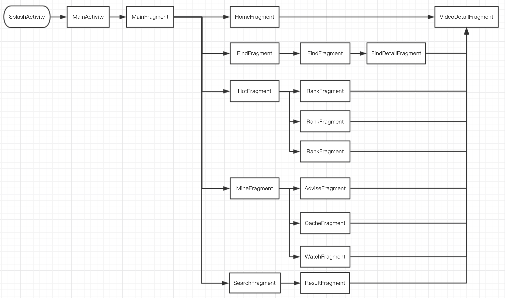

# EyeKotlin
> Kotlin作为安卓的官方开发语言, 还是要学一下的 在过年时花了一个星期看了下文档, 也写了一些小DEMO, 感觉是时候开始写一些比较完整的项目了

# 架构
1. 采用主流MVP + Retrofit + RxJava进行开发
2. 单Activity + 多Fragment

# 界面设计
欢迎页 | 首页
-- | -- | --
 | 

发现 | 排行
-- | --
 | 

视频详情 | 视频播放
-- | --
 | 

# 逻辑图


# Kotlin的优点
### 简介
使用一行代码创建一个包含 getters、 setters、 equals()、 hashCode()、 toString() 以及 copy() 的 POJO：
```
data class Customer(val name: String, val email: String, val company: String)
```
或者使用 lambda 表达式来过滤列表：
```
val positiveNumbers = list.filter { it > 0 }
```
想要单例？创建一个 object 就可以了：
```
object ThisIsASingleton {
    val companyName: String = "JetBrains"
}
```

###安全
彻底告别那些烦人的 NullPointerException——著名的十亿美金的错误。
```
var output: String
output = null   // 编译错误
```
Kotlin 可以保护你避免对可空类型的误操作
```
val name: String? = null    // 可控类型
println(name.length())      // 编译错误
```
并且如果你检查类型是正确的，编译器会为你做自动类型转换
```
fun calculateTotal(obj: Any) {
    if (obj is Invoice)
        obj.calculateTotal()
}
```

# 开源库
开源库 | 用途
-- | --
Retrofit | 网络请求
RxJava | 响应式编程
Glide | 图片缓存加载
RxDownload | 视频下载
GSYVideoPlayer | 视频播放器
BaseRecyclerViewAdapterHelper | 对adapter的封装
fragmentation | 管理fragment
